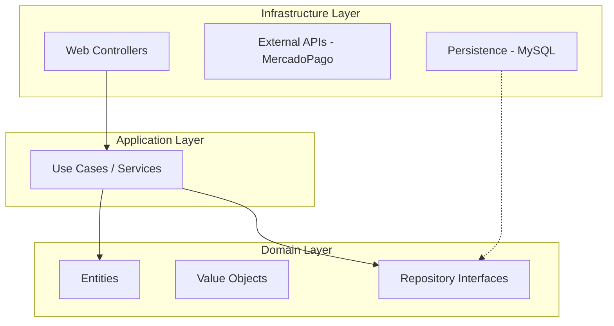

# 🏟️ FutGo | Sistema de Gestión y Reservas de Canchas Deportivas


## 🌟 Visión del Proyecto
FutGo es una plataforma integral diseñada para digitalizar y optimizar la experiencia de reserva de campos deportivos. Conecta a jugadores con complejos deportivos (Partners) a través de un ecosistema que incluye una PWA para Staff, paneles de administración avanzada y una interfaz de usuario intuitiva y de alto rendimiento.

---

## 🛠️ Stack Tecnológico
*   **Core:** Laravel 11 (PHP 8.2+)
*   **Base de Datos:** MySQL 8.0 (Motor transaccional con soporte Geospacial)
*   **Frontend:** Blade Templates + Tailwind CSS + Vite
*   **Iconografía:** Phosphor Icons
*   **Infraestructura:** Soporte para Redis (Cache/Sessions) y Arquitectura Hexagonal.

---

## 🏗️ Arquitectura del Sistema
El proyecto está en proceso de migración hacia una **Arquitectura Hexagonal (Puertos y Adaptadores)** para garantizar el desacoplamiento de la lógica de negocio y facilitar la escalabilidad.



### Principios de Diseño
1.  **Cero Cálculos en Memoria:** Búsquedas geospaciales delegadas a MySQL 8 mediante `ST_Distance_Sphere`.
2.  **Concurrencia Garantizada:** Uso de *Optimistic Locking* (versión en slots) para evitar sobre-reservas.
3.  **Inmutabilidad:** Registro de auditoría (`audit_logs`) y snapshots de precios en el momento de la reserva.
4.  **Seguridad:** IDs públicos basados en UUIDs e idempotencia en transacciones financieras.

---

## 📦 Módulos Principales

### 👤 Jugador (Player)
*   Búsqueda avanzada por ubicación y tipo de campo.
*   Reserva de múltiples slots contiguos.
*   Checkout seguro con MercadoPago y anticipos online.
*   Perfil con historial y QR dinámico de acceso.

### 🤝 Complejo (Partner)
*   Dashboard de métricas e ingresos en tiempo real.
*   Gestión de matriz de horarios y precios diferenciales (Día/Noche).
*   Configuración de bloqueos especiales y eventos.
*   Administración de Staff asignado.

### 📱 Staff PWA
*   Interfaz optimizada para móviles (Offline-first ready).
*   Escaneo de QR para Check-in instantáneo.
*   Registro de reservas presenciales (*Walk-ins*).
*   Gestión y auditoría de caja por turno.

### 🛡️ Administración (Admin)
*   Aprobación y monitoreo de Partners.
*   Configuración de comisiones y fees de plataforma.
*   Trazabilidad total mediante logs de auditoría inmutables.

---

## 🚀 Instalación y Configuración

1.  **Clonar el repositorio:**
    ```bash
    git clone <url-del-repo>
    cd futbo2
    ```

2.  **Instalar dependencias:**
    ```bash
    composer install
    npm install
    ```

3.  **Configurar entorno:**
    ```bash
    cp .env.example .env
    # Configurar las credenciales de MySQL 8 y Redis en .env
    ```

4.  **Ejecutar migraciones y seeders:**
    ```bash
    php artisan migrate --seed
    ```

5.  **Compilar activos:**
    ```bash
    npm run dev
    ```

---

## 🔍 Estado del Proyecto y Auditoría
Actualmente el proyecto se encuentra en una fase de refactorización tras la migración a MySQL 8. Para consultar los detalles técnicos, deudas de arquitectura o bugs identificados, consulte nuestro archivo de auditoría interna:

📄 **[errores.txt](errores.txt)**

---
Developed with ❤️ by the FutGo Team.
