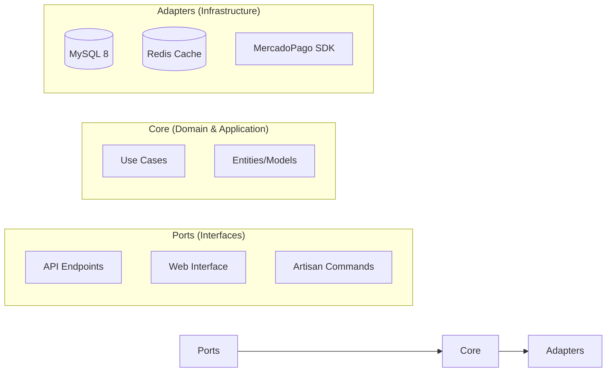

# 🏟️ FutGo | Sistema de Gestión y Reservas de Canchas Deportivas


<p align="center">
    
    
    
    
</p>

---

## 🌟 Visión y Problemática
### El Problema
La gestión de complejos deportivos en entornos urbanos sufre de una fragmentación crítica:
*   **Gestión Manual:** Uso de cuadernos o Excel, propenso a errores humanos y sobre-reservas.
*   **Falta de Visibilidad:** Los jugadores no pueden conocer la disponibilidad real sin llamar por teléfono.
*   **Inseguridad en Pagos:** Riesgo de "No-shows" (inasistencias) sin garantía de cobro.
*   **Descontrol de Caja:** Dificultad para auditar los ingresos en efectivo de múltiples turnos de staff.

### La Solución: FutGo
FutGo digitaliza el ciclo completo de vida de una reserva deportiva, proporcionando:
1.  **Transaccionalidad Segura:** Pagos de anticipos online para garantizar la reserva.
2.  **Inventario en Tiempo Real:** Generación automatizada de slots y protección contra concurrencia.
3.  **Auditoría Forense:** Registro inmutable de cada acción (Audit Logs) y cuadre de caja (Shift Logs).
4.  **Ecosistema Multirrol:** Interfaces especializadas para cada actor del sistema.

---

## 📊 Especificaciones Técnicas

### Stack de Tecnología (Sección 9.1)
*   **Lenguaje:** PHP 8.2.x (Tipado estricto habilitado)
*   **Framework:** Laravel 11.x (Core del Sistema)
*   **Base de Datos:** MySQL 8.0.x (Configuración: `utf8mb4_0900_ai_ci`)
*   **Cache & Concurrencia:** Redis 7.x (Estrategia de Optimistic Locking)
*   **Frontend:** JavaScript ES6+, Blade, Tailwind CSS 3.x, Phosphor Icons
*   **Geolocalización:** Soporte nativo para tipos `POINT` y funciones `ST_*`

### Metodologías y Reglas de Oro (Sección 1.2)
1.  **Regla 4 (Cero Cálculos en Memoria):** Las búsquedas por radio y distancia se ejecutan al 100% en el motor de base de datos (MySQL 8).
2.  **Regla 8 (Escalabilidad):** Carga perezosa (*Lazy Loading*) y paginación obligatoria en todas las vistas de administración y búsqueda.
3.  **Inmutabilidad:** Registro de auditoría forense (`audit_logs`) con seguimiento de `actor_role` y `user_agent` (Secc. 10.2.2).
4.  **Desacoplamiento:** Transición activa hacia Arquitectura Hexagonal para independizar la lógica de negocio de la infraestructura.

---

## 🏗️ Arquitectura y Casos de Uso

### Patrón Arquitectónico
El sistema implementa una **Arquitectura de Capas Desacopladas**, evolucionando hacia un modelo Hexagonal:



### Casos de Uso Principales

#### 👤 Jugador (Player)
1.  **UC-01: Búsqueda Geospacial:** Localizar canchas disponibles en un radio de acción específico.
2.  **UC-02: Reserva Multinivel:** Seleccionar múltiples horas y campos en una sola transacción.
3.  **UC-03: Pago de Anticipo:** Garantizar la reserva mediante pasarela de pago segura.

#### 🤝 Complejo (Partner)
1.  **UC-04: Gestión de Inventario:** Configurar matrices de precios dinámicos (Día/Noche/Especial).
2.  **UC-05: Monitor de Ingresos:** Visualizar KPIs de ocupación y rentabilidad.
3.  **UC-06: Gestión de Staff:** Asignar y revocar permisos a trabajadores del complejo.

#### 📱 Staff PWA
1.  **UC-07: Check-in por QR:** Validar y registrar la llegada del cliente en milisegundos.
2.  **UC-08: Registro de Walk-in:** Venta directa en mostrador con actualización de inventario.
3.  **UC-09: Cierre de Caja:** Reporte y auditoría de efectivo al finalizar el turno.

---

## 🚀 Instalación y Configuración

1.  **Clonar el repositorio:**
    ```bash
    git clone https://github.com/paraZmol/FutGo.git
    cd futbo2
    ```

2.  **Instalar dependencias:**
    ```bash
    composer install
    npm install
    ```

3.  **Configurar entorno:**
    ```bash
    cp .env.example .env
    # Configurar las credenciales de MySQL 8 y Redis en .env
    ```

4.  **Ejecutar migraciones y seeders:**
    ```bash
    php artisan migrate --seed
    ```

5.  **Compilar activos:**
    ```bash
    npm run dev
    ```

## ⚙️ Personalización y Marca (Branding)
FutGo incluye un sistema de gestión de marca dinámico que permite a los administradores (`Super Admins`) ajustar la identidad del sitio desde el panel de control sin modificar archivos de configuración:

*   **Identidad Visual:** Cambio de nombre del sistema (`site_name`), eslogan (`site_tagline`) y logotipo.
*   **Tematización:** Ajuste de colores corporativos principales que se reflejan en toda la plataforma.
*   **Localización Global:** Configuración centralizada de moneda (`site_currency`), país y datos de contacto.
*   **Optimización:** Los ajustes se gestionan mediante el modelo `SiteSetting` con un sistema de **Caché de alto rendimiento** (5 min) para garantizar impacto cero en la velocidad de carga.

---

## 🔍 Estado del Proyecto y Auditoría
Actualmente el proyecto se encuentra en una fase de refactorización tras la migración a MySQL 8. Para consultar los detalles técnicos, deudas de arquitectura o bugs identificados, consulte nuestro archivo de auditoría interna:

📄 **[errores.txt](errores.txt)**

---
Developed with ❤️ by the FutGo Team.
